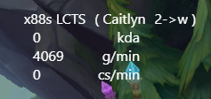

# LCTS (League Client TypeScript)
A feature rich league client written is TypeScript

## UI


## overlay


## Prerequisites
- TypeScript - [Download & Install TypeScript](https://www.typescriptlang.org/download). Used for compiling and the TypeScript enviroment
```
$ npm install -g typescript
```

## Installing the client
Just donwload the client from the [releases](https://github.com/cactoes/lcts/releases) tab & run lcts.exe

## Installing the client from source
```
$ git clone https://github.com/cactoes/lcts.git
$ cd lcts
$ npm install
```

## Running the client from source
Run & Compile the source
```
$ npm run test
```

## Compiling the client
Run & Compile the source
```
$ npm run package:win
```

## Scripting
The client allows for function scripting (within LCTS itself), the script is located in [resources/data/script.js](resources/data/script.js)
### Structure
```javascript
class LCScript {
  // when the game launches onUserConnect is called
  async onUserConnect(user, lobby) {
    return true
  }

  // when user joins a party onPartyJoin is called
  async onPartyJoin(user, lobby) {
    return true
  }
}
```

### Methods
Methods are called like this
```Javascript
await user.setStatus("example")
```
#### Methods in *user*
- [IUser](src/types.d.ts#L158) Interface/Type
```TypeScript
async function setStatus(status: string): Promise<IUser>
async function setRank(tier: string, rank: string): Promise<IUser>
```
#### Methods in *lobby*
- [ILobby](src/types.d.ts#L283) Interface/Type
```TypeScript
async function setLanes(first: string, second: string): void
async function create(queueId: number): Promise<ILobby>
async function setPartyType(type: string): void
async function startSearch(): void
async function stopSearch(): void
```

## Contributing 
Steps for contributing
- choose a [task](TODO.md) / or come up with a new task
- contact me (cactus#9276) so i can link you to the task
- fork the project
- make changes (and document your code + add any types needed)
- upload for reviewing

## License
[GNU GPLv3](LICENSE)