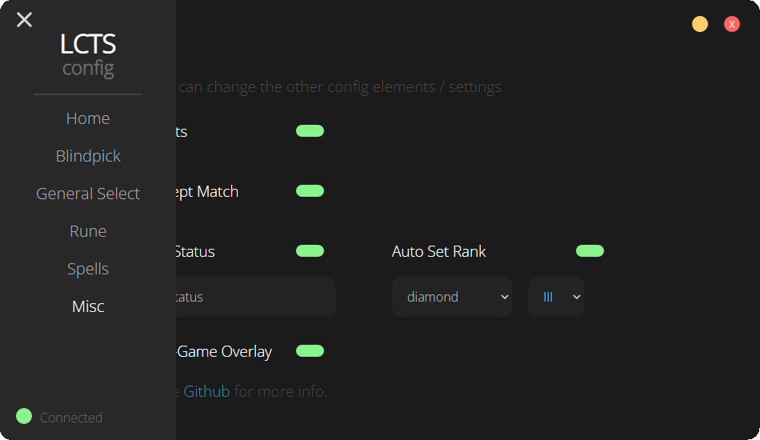
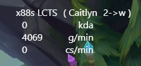

# LCTS (League Client TypeScript)
A feature rich league client written in TypeScript, with scripting & more 

## Installing the client
Just download the client from the [releases](https://github.com/cactoes/lcts/releases) tab & run 'lcts.exe'

## A clean UI
A stylish clean ui, for ease of use



## An x88 style overlay
Your game has to be in borderless (or windowed) to work, (can be turned off)



## Features
- automatically
  - accept the match
  - pick
    - a champion to play
    - a champion to ban
  - set runes (runes do change you might not be able to see the changes when editing)
  - set summoner spells
  - check if you got the lane you want
- [scripting](#scripting)
- ui customizability (check [config](resources/data/config.json))
- [config](#config)

## Config
The config is located in [resources/data/config.json](resources/data/config.json), here you can customize everything
### Structure
```javascript
{
  "auto": {
    "acceptMatch": true, // automatically accepting a match
    "champion": {
      "set": true, // "hovering" of your pick/ban
      "lock": true, // lock-in the selected champion
      "ban": true, // ban the selected champion
      "checkLane": true, // check if the lane you got was the lane you chose in the lobby (primary lane only), for picking/banning
      "defaultLane": "utility", // if you didn't choose a lane this will be the lane it uses instead
      "lanePick": {
        "top": [
          "Gwen" // the list of champion you want to pick on the top lane
        ],
        "jungle": [
          "Lilia" // the list of champion you want to pick in the jungle
        ],
        "middle": [
          "Irelia" // the list of champion you want to pick on mid
        ],
        "bottom": [
          "Caitlyn" // the list of champion you want to pick as the adc
        ],
        "utility": [
          "Renata" // the list of champion you want to pick as the support
        ]
      },
      "laneBan": {
        "top": [
          "Garen" // the list of champion you want to ban on the top lane
        ],
        "jungle": [
          "Belveth" // the list of champion you want to ban in the jungle
        ],
        "middle": [
          "Akali" // the list of champion you want to ban on mid
        ],
        "bottom": [
          "Ezreal" // the list of champion you want to ban as the adc
        ],
        "utility": [
          "Leona" // the list of champion you want to ban as the support
        ]
      }
    },
    "runes": {
      "set": true, // automatically set the runes of the locked in champion
      "prefix": "[u.gg]" // change the runes that start with this
    },
    "spells": {
      "set": true, // automatically set you summoner spells
      "defaultLane": "utility", // if you didn't choose a lane this will be the lane it uses instead
      "lane": {
        "top": [
          "Teleport", // *D*
          "Flash" // *F*
        ],
        "jungle": [
          "Smite", // *D*
          "Flash" // *F*
        ],
        "middle": [
          "Ignite", // *D*
          "Flash" // *F*
        ],
        "bottom": [
          "Heal", // *D*
          "Flash" // *F*
        ],
        "utility": [
          "Ignite", // *D*
          "Flash" // *F*
        ]
      }
    }
  },
  "misc": {
    "status": {
      "text": "default-status", // what to set the status to
      "set": false // auto set it
    },
    "rank": {
      "tier": "diamond", // for storing your tier so you can use it in a script
      "rank": "III", // for storing your rank so you can use it in a script
      "set": false // auto set it
    }
  },
  "script": {
    "userScript": true, // make use of the user made script (script.js)
    "auto": {
      "kiter": { // auto kiter
        "enabled": true, // do we want to use it
        "keybinds": {
          "activate": "c", // keybind for activating the kite bot
          "attackMove": "n" // keybind for attack move
        }
      }
    }
  },
  "overlay": true // enable in game overlay
}
```

## Scripting
LCTS has **2** types of scripts

### Actual scripts
Actual scripts that may get you banned LCTS is not responisible for your account, customizabel in the config or ui
- auto kiter
  - enable / disable
  - keybind (default is "c")
  - attack move keybind (default is "n")

### User made scripts
The client allows for function scripting (within LCTS itself), the script is located in [resources/data/script.js](resources/data/script.js). <br />
- The script has to be called "**script.js**" so the client can find it. <br />

There are some default scripts available just rename the one you want to "**script.js**", and restart the LCTS to run them.
- The default script are located in the "**examples**" folder

### Structure
```javascript
class LCScript {
  // when the game launches
  async onUserConnect(user, lobby, config) {
    // your code goes here
    return true
  }

  // when user joins a party
  async onPartyJoin(user, lobby, config) {
    // your code goes here
    return true
  }
}
```

### Methods
Methods are called like this
```Javascript
await user.setStatus("example")
```
#### Methods in *user*
- [IUser](src/types.d.ts#L158) Interface/Type
```TypeScript
async function setStatus(status: string): Promise<IUser>
async function setRank(tier: string, rank: string): Promise<IUser>
```
#### Methods in *lobby*
- [ILobby](src/types.d.ts#L283) Interface/Type
```TypeScript
async function setLanes(first: string, second: string): Promise<void>
async function create(queueId: number): Promise<ILobby>
async function leave(): Promise<void>
async function setPartyType(type: string): Promise<void>
async function startSearch(): Promise<void>
async function stopSearch(): Promise<void>
```
#### Config
All the saved config data at that moment in [config.json](resources/data/config.json)

## Prerequisites
If you want to run the client from source make sure you have:
- TypeScript - [Download & Install TypeScript](https://www.typescriptlang.org/download). Used for compiling and the TypeScript enviroment
```
$ npm install -g typescript
```

## Dependencies
- electron-overlay-window@2.0.1
- lcinterface@4.0.0
- node-fetch@2.6.1
- node-html-parser@5.3.3

## DevDependencies
- electron@19.0.5
- electron-packager@15.5.1

## Installing the client from source
```
$ git clone https://github.com/cactoes/lcts.git
$ cd lcts
$ npm install
```

## Running the client from source
Run & Compile the source
```
$ npm run test
```

## Compiling the client
Run & Compile the source
```
$ npm run package:win
```

## Contributing 
Steps for contributing
- choose a [task](TODO.md) / or come up with a new task
- contact me (cactus#9276) so i can link you to the task
- fork the project
- make changes (and document your code + add any types needed)
- upload for reviewing

## Logo
The logo isn't mine it was made by [surgingpink](https://www.deviantart.com/surgingpink)

## License
[GNU GPLv3](LICENSE)
